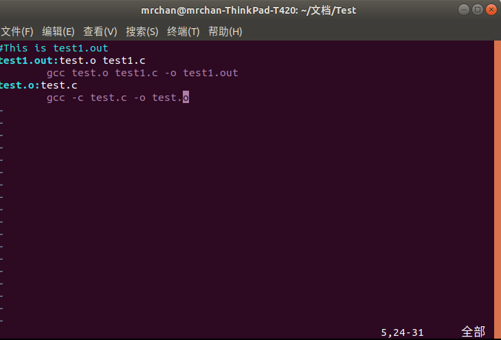
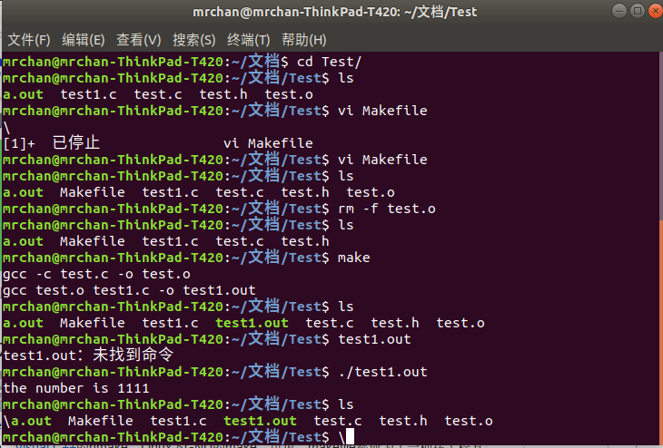

# Linux  C语言

## 1. 基本的文件创建命令

```
touch a.c
touch a.h
......
```

## 2. C语言中变量的定义与文件包含

```
int 变量 = 变量值；
int 方法名（）{}
printf();			#文件输出 
printf（“print is %d \n”,变量名） 			每一个%d 后面对应同一顺序的变量；
```

```
文件包含：
include <stdio.h> 	标准输入输出			<> 代表系统文件
在c中 一般包含.h等都代表系统头文件 用于将.c等文件中常用的但不常改改动的函数放在一个文件内，减少整体代码的尺寸；

```

```
main函数 一般为c语言执行入口 他并不需要转为.o等文件

```

```
常用的gcc命令
gcc 文件1 文件2 -o 	执行文件.out			#将文件1 文件2合并到同一个执行文件.out中
gcc -c 文件1 文件2 -o 					#将文件1 文件2 转为及其识别文件 xxx.o 减少空间；
```

```
如何实现在工作环境下使得被转为.o的文件能看到其代表的函数类型及函数参数呢？
1.在执行文件中效仿类似系统文件 stdio.h的做法 新建一个包含函数名 函数参数以及类型的.h文件
2.在执行文件.c中头部包含xxx.h文件
#include“xxx.h”
3.这样就能实现在不同开发者下既不泄露源函数构造 又能查看函数类型的方法了
```


## 3. Makefile 的编写

### Makefile 文件是一个工程中的源文件不计其数，其按类型、功能、模块分别放在若干个目录中，makefile定义了一系列的规则来指定哪些文件需要先编译，哪些文件需要后编译，哪些文件需要重新编译，甚至于进行更复杂的功能操作，因为 makefile就像一个[Shell脚本](https://baike.baidu.com/item/Shell脚本)一样，也可以执行操作系统的[命令](https://baike.baidu.com/item/命令/8135974)。

### makefile带来的好处就是——“自动化编译”，一旦写好，只需要一个make命令，整个工程完全自动编译，极大的提高了软件开发的效率

```
操作步骤：
1. vim Makefile
   touch Makefile 			创建一个Makeile文件
2. 文件内容编辑：
#Tihs is test1.out action by Makefile
test1.out：test.o test1.c
		gcc test.o test1.c -o test1.out							#空白处六个space Tab健
test.o:test.c
		gcc -o test.c -o test.o
		
保存退出
3. 命令行界面
make															#直接make

```

#### 实现逻辑:

#### make会读取makefile文件内容。执行第一行命令 如果发现文件缺少 则会向下依次递归查询执行文件。从而达到自动化编译功能；






## 4.main执行文件的return返回参数的问题

```
我们一般都会默认参数为0
如果使用以下命令：
gcc main.c -o main.out && ./main.out
程序默认&&前的代码执行完毕之后 如果返回0 就代表没有问题，执行接下来的代码
显而易见：
我们在代码中return 0；	是有意义的 成功就返回0 方便下面内容执行；
如果数字是其他 就代表某一步出错，自行排查即可；
```

#### echo $?	# 显示代码return值 默认 0为成功；


## 5. 输出流 与 输入流 与 错误流

#### 输出流：指程序运行所输出的结果 输出到哪，如果没有输出流重定项的话默认输出到显示器终端；

#### 输入流：指程序运行所需要输入数据或指令的地方，默认为键盘

#### 错误流：指程序运行出错时输出的错误提示 可自定义，一般return不为0

```c
#include<stdio.h>
// stdin
// stdout
// stderr
int main ()
{
	// printf("This is print");
    int a;
 
    fprintf(stdin,"This is print")；
    // scanf("This is scanf);
    fscanf(%d,a);
    fprintf(stdin,"This number is %d",a);
    if(0==a){
        fprintf(stderr,"sorry you num must not 0");
        return 1;
    }
    return 0;
}
```


### 6. 输出流与输入流与错误流的重定向；

```
gcc main.c -o main.out
./main.out 1>> 1.txt					#将./main.out 的输出 到1.txt中 覆盖可用 >/1>
./main.out 2>> 2.txt					#将./main.out 的错误 到2.txt中 覆盖可用 2>
./main.out << input.txt					#将input.txt中内容输入到main.txt中去但内容类型必须一致
./main.out 1>> 1.txt 2>>2.txt <<input.txt			#可以一起使用；
```


### 7. 管道技术的使用

```c
ls /etc | gerp xxx						#查找出/etc文件目录，输出的结果 作grep匹配；
以下测试；
在 avg文件中；
#include<stdio.h>
int main ()
{
        int i;
   		int count;
        scanf("%d,%d",&i,&count);
    float av = i/count;
    printf("you numbers avg is %f",av);
    return 0;
}

在统计总和和个数的函数
#include<stdio.h>
int main()
{
    int flag = 1;
    int all;
    int count=0;
    int s=0;
    while(flag)
    {	scanf("%d",&all);
        if(0==all)
        break;
     	count++;
     	s=s+all;
        
    }
    printf("%d,%d",s,count);
    return 0;
}

linux 命令行
./b.txt | ./a.txt
```

